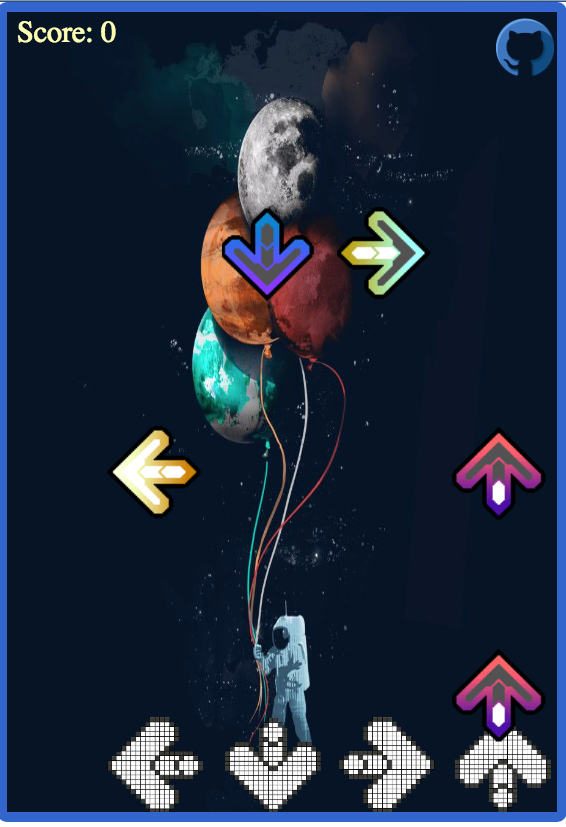

# [Keyboard Hero][link]
[link]: http://phchung.github.io/phchung/Keyboard-Hero


#Instructions

Use QWER to match the floating arrows. The objective is to get as many points as you can.

#Game Design

This game was created with:

- Javascript
- HTML5 Canvas
- Bootstrap
- jQuery

Desinging the timing between the arrows and the song required creating an internal clock when the song has started.

```
GameView.prototype.songStarted = function(){
  this.startTime = new Date().getTime()/1000
}
```


